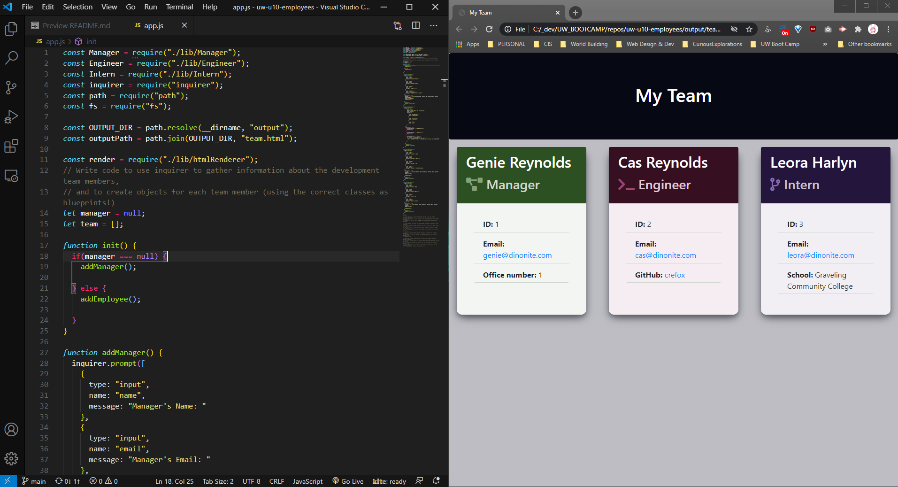

# Team Page Generator
[](https://opensource.org/licenses/MIT)

## Description
Generate an HTML page with basic employee info for your team. Generator is run from the CLI and produces an HTML file, which is saved to the *output* folder.

## Table of Contents
* [Installation](#Installation)
* [Usage](#Usage)
* [Contributing](#Contributing)
* [Tests](#Tests)
* [Questions](#Questions)
* [License](#License)



[](https://drive.google.com/file/d/1_xhOIw2f-WrxE13LRzyNIkwmhQ_vIIpo/view)  
*Click to view the full-size video on Google Drive*

## Installing
- ```git clone``` the repo
- run ```npm i``` to install the required packages

## Usage
- Run ```node index.js``` to start the generator
- Answer the prompts until you've added info for all employees on your team
- The "What do you want to do?" prompt repeats ad infinitum until you select ```exit```

The HTML page is saved to the ```output``` directory as ```team.html``` 

### Contributing
You're welcome to either fork the repo or submit a pull request with an update. This was a homework assignment, however, so it's not meant to be fancy or robust.

### Tests
run ```npm test``` (or ```npm run test```) to run the included jest tests.

### Questions
- Find me on Github: [skelliebunnie](https://github.com/skelliebunnie)
- Email me at: skelliebunnie@gmail.com

### License
MIT LICENSE 

Copyright (C) 2021 Angel

https://opensource.org/licenses/MIT

Permission is hereby granted, free of charge, to any person obtaining a copy of this software and associated documentation files (the "Software"), to deal in the Software without restriction, including without limitation the rights to use, copy, modify, merge, publish, distribute, sublicense, and/or sell copies of the Software, and to permit persons to whom the Software is furnished to do so, subject to the following conditions:

The above copyright notice and this permission notice shall be included in all copies or substantial portions of the Software.

THE SOFTWARE IS PROVIDED "AS IS", WITHOUT WARRANTY OF ANY KIND, EXPRESS OR IMPLIED, INCLUDING BUT NOT LIMITED TO THE WARRANTIES OF MERCHANTABILITY, FITNESS FOR A PARTICULAR PURPOSE AND NONINFRINGEMENT. IN NO EVENT SHALL THE AUTHORS OR COPYRIGHT HOLDERS BE LIABLE FOR ANY CLAIM, DAMAGES OR OTHER LIABILITY, WHETHER IN AN ACTION OF CONTRACT, TORT OR OTHERWISE, ARISING FROM, OUT OF OR IN CONNECTION WITH THE SOFTWARE OR THE USE OR OTHER DEALINGS IN THE SOFTWARE.